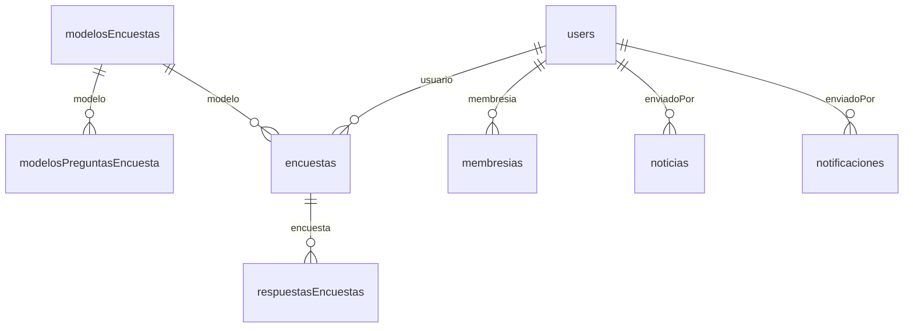

# Modelo de datos (Firestore)

Resumen de **colecciones** alineadas con `lib/backend/schema/*_record.dart`. Otras colecciones pueden existir solo en acciones custom o en Cloud Functions: búscalas con `collection('` en el repo.

---

## Colecciones con registro Dart en `schema/`

| Colección | Archivo | Rol breve |
|-----------|---------|-----------|
| `users` | `users_record.dart` | Perfil, roles, membresía, jerarquía promotor/promovido, flags de app. |
| `encuestas` | `encuestas_record.dart` | Instancias de encuestas aplicadas o en curso. |
| `respuestasEncuestas` | `respuestas_encuestas_record.dart` | Respuestas ligadas a encuestas. |
| `modelosEncuestas` | `modelos_encuestas_record.dart` | Plantillas de encuesta. |
| `modelosPreguntasEncuesta` | `modelos_preguntas_encuesta_record.dart` | Preguntas por modelo. |
| `paqueteEncuestas` | `paquete_encuestas_record.dart` | Paquetes comerciales de encuestas. |
| `membresias` | `membresias_record.dart` | Membresías de usuarios. |
| `Promovidos` | `promovidos_record.dart` | Red de promovidos (nombre con mayúscula en Firestore). |
| `noticias` | `noticias_record.dart` | Noticias y metadatos (likes, autor, etc.). |
| `notificaciones` | `notificaciones_record.dart` | Notificaciones enviadas/recibidas. |
| `incidencias` | `incidencias_record.dart` | Incidencias / tickets. |
| `config` | `config_record.dart` | Parámetros globales de la app. |
| `textos` | `textos_record.dart` | Textos configurables. |

---

## Structs embebidos (no son colección raíz)

Definidos en `lib/backend/schema/structs/` (p. ej. comentarios, respuestas libres, usuarios en línea). Se guardan **dentro** de documentos según el diseño de cada record.

---

## Colecciones usadas en código custom (ejemplos)

Aparecen en `lib/custom_code/actions/delete_referencias_usuario.dart` y similares; conviene tenerlas en reglas e índices:

| Colección | Uso típico |
|-----------|------------|
| `chat_messages` | Mensajes de chat. |
| `chats` | Conversaciones y listas `users`. |
| `formatosFirmados` | Documentos firmados por usuario. |
| `preguntas` | Preguntas con `creadaPor`, `listaUsuarios`, etc. |

La colección **`ff_user_push_notifications`** (o equivalente) puede usarse para tokens FCM según `lib/backend/push_notifications/`.

---

## Diagrama lógico (Mermaid)

Relaciones aproximadas (el esquema real depende de los campos `DocumentReference` en cada record):

---

## Mantenimiento

- Tras un export FlutterFlow, revisar si aparecen **nuevos** `*_record.dart` o campos y actualizar esta tabla.
- Para índices compuestos nuevos, actualizar `firebase/firestore.indexes.json` y desplegar.
